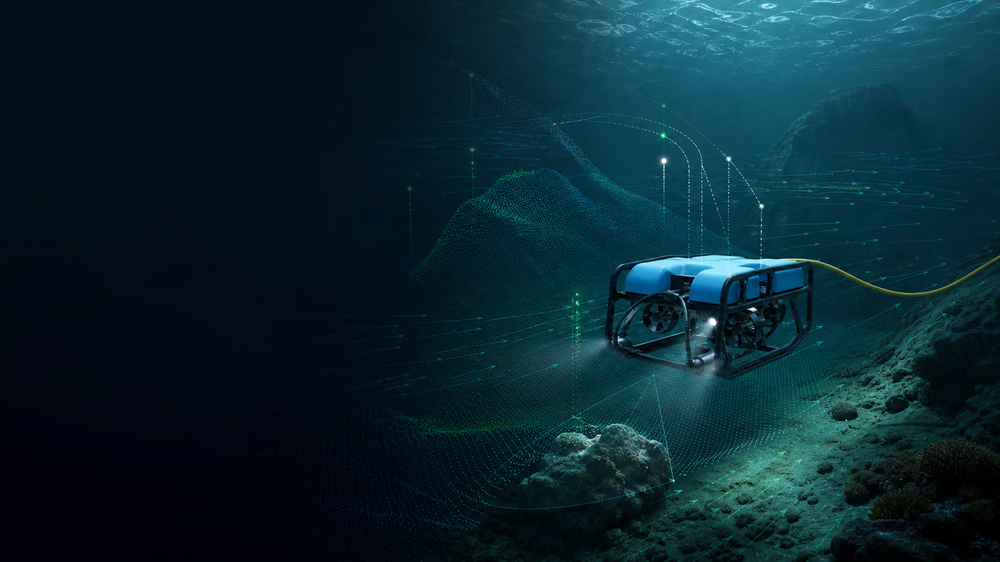

# Ocean World Labs

**Building the world model for the ocean**

Ocean World Labs is building a physics-grounded data and model system for ocean
embodied intelligence. Ocean simulation built for fidelity and scale is the
foundation. The Ocean World Model is the core. Ocean embodied intelligence is
the destination.

Concept visualization · Ocean World Model direction

## The system

| Layer | Role | Status |
|---|---|---|
| **OceanScale** | Generates controllable, reproducible simulation data and evaluation cases | Current product · working alpha |
| **Ocean World Model** | Learns ocean-state evolution, action consequences, and future trajectories | Internal R&D · not publicly released |
| **Ocean embodied intelligence** | Brings prediction, action, and real-task feedback onto ocean robots | Next validation stage |

## Evidence today

- GPU-native hydrodynamics, fluid methods, underwater sensors, scenes,
  vectorized environments, deterministic replay, and evaluation workflows
- **4,588,922 environment steps per second** in the launch-standard workload:
  4,096 environments, 200 steps, one RTX 5090
- One anonymized paid pre-sea-trial simulation engagement completed; additional
  paid pilots in discussion

The benchmark measures environment steps and excludes rendering and the complete
sensor chain. It is workload-specific and is not a universal performance claim.
Customer identity and private field material are not disclosed.

Real simulator output · Isaac Sim 6 · PathTracing · OceanScale scene

## NVIDIA technology path

- **Current:** CUDA, RTX, PyTorch, Warp, Newton
- **Validation lane:** OpenUSD, Omniverse, Isaac Sim 6, Isaac Lab 3
- **Internal R&D:** NVIDIA Cosmos 3
- **Next stage:** Jetson, TensorRT, Isaac ROS

This describes technology adoption only. It does not imply NVIDIA affiliation
or endorsement.

## Open community

We intend to build an open technical community around reproducible ocean
simulation, datasets, benchmarks, and evaluation that can advance the entire
field. Public repositories will appear here as releases mature.

[Website](https://oceanworldlabs.com) ·
[Contact](mailto:info@oceanworldlabs.com)
