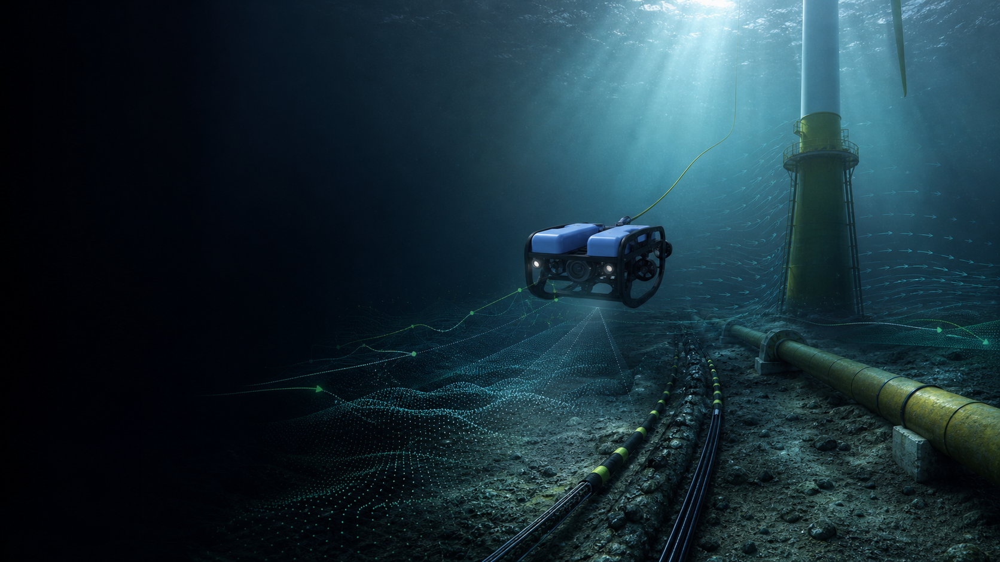
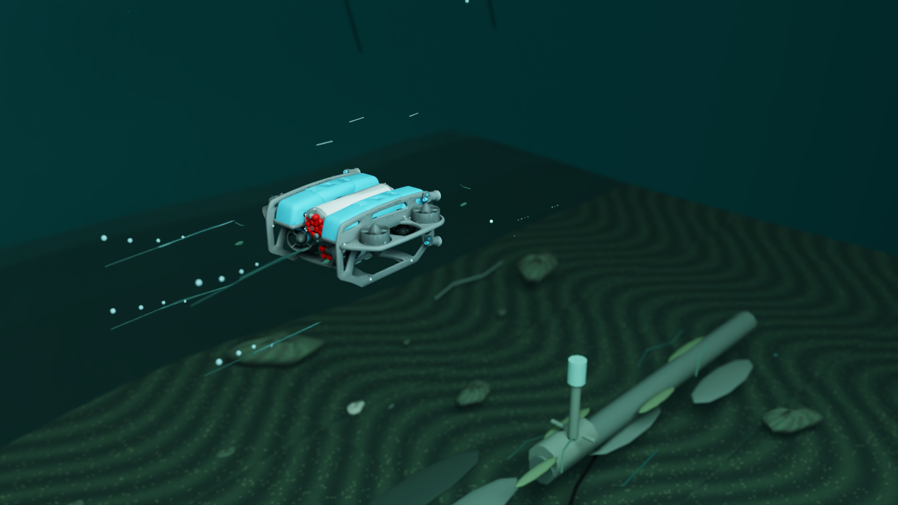

# Ocean World Labs

**The world model that enables machines to work in the ocean**

Ocean World Labs is building the shared simulation, data, model, evaluation,
and deployment loop for ocean machines. OceanScale is the high-fidelity,
scalable simulation foundation. The internal Ocean World Model is the learning
core. Underwater robotics is the first commercial wedge and real-data channel.

Concept visualization · Ocean industries and Ocean World Model direction

## Why the ocean needs a shared intelligence layer

Offshore wind, offshore oil and gas, subsea cables and pipelines, engineering,
and science all require machines to perceive, predict, act, and learn in fluid
environments that change across location and time.

- Global ocean trade reached approximately **USD 2.2 trillion in 2023**
  ([UN Trade and Development](https://unctad.org/news/fast-growing-trillion-dollar-ocean-economy-goes-beyond-fishing-and-shipping)).
- The IEA forecasts approximately **140 GW of offshore wind additions from 2025
  through 2030**
  ([IEA Renewables 2025](https://www.iea.org/reports/renewables-2025/renewable-electricity)).
- More than **70% of recent conventional oil and gas project approvals are
  offshore**
  ([IEA](https://www.iea.org/reports/the-implications-of-oil-and-gas-field-decline-rates/executive-summary)).
- Submarine cables carry more than **99% of international data traffic**
  ([ITU](https://www.itu.int/en/mediacentre/backgrounders/Pages/submarine-cable-resilience.aspx)).

These figures describe the operating domain. They are not Ocean World Labs
market size or revenue forecasts.

## The system

| Layer | Role | Status |
|---|---|---|
| **OceanScale** | Generates controllable, reproducible simulation data and evaluation cases | Current product · working alpha |
| **Ocean World Model** | Learns ocean-state evolution, action consequences, and future trajectories | Internal R&D · not publicly released |
| **Ocean embodied intelligence** | Brings prediction, action, and real-task feedback onto ocean robots | Next validation stage |

The strategic transition is from every mission starting from zero to every
mission improving the model and the next machine.

## First market and expansion

The first paid workflow is pre-sea-trial simulation and evaluation for ROV and
AUV developers and operators. One anonymized paid engagement has been
completed, and additional paid pilots are in discussion.

The same learning system can expand across offshore wind, offshore oil and gas,
subsea cables and pipelines, ocean engineering, and scientific operations.
Customer identity, pricing, task details, and private field material are not
disclosed.

## Evidence today

- GPU-native hydrodynamics, fluid methods, underwater sensors, scenes,
  vectorized environments, deterministic replay, and evaluation workflows
- **4,588,922 environment steps per second** in the launch-standard workload:
  4,096 environments, 200 steps, one RTX 5090
- Structured state, action, sensor, and outcome data with deterministic replay
  and evaluation baselines

The benchmark measures environment steps and excludes rendering and the complete
sensor chain. It is workload-specific and is not a universal performance claim.
The Ocean World Model remains internal R&D. No mature model, deployed autonomy,
or sim-to-real result is claimed.

Real simulator output · Isaac Sim 6 · PathTracing · OceanScale scene

## NVIDIA technology path

- **Current:** CUDA, RTX, PyTorch, Warp, Newton
- **Validation lane:** OpenUSD, Omniverse, Isaac Sim 6, Isaac Lab 3
- **Internal R&D:** NVIDIA Cosmos 3
- **Next-stage data factory:** Replicator, Curator, Transfer, Evaluator, OSMO
- **Next-stage deployment:** Jetson, TensorRT, Isaac ROS

This describes technology adoption only. It does not imply NVIDIA affiliation
or endorsement.

## Open community

We intend to build an open technical community around reproducible ocean
simulation, public reference assets, datasets, benchmarks, and evaluation
protocols. Open infrastructure can advance the field; proprietary customer
scenarios, calibrated data, hosted workflows, and model capabilities support
the commercial system.

[Website](https://oceanworldlabs.com) ·
[Contact](mailto:info@oceanworldlabs.com)
