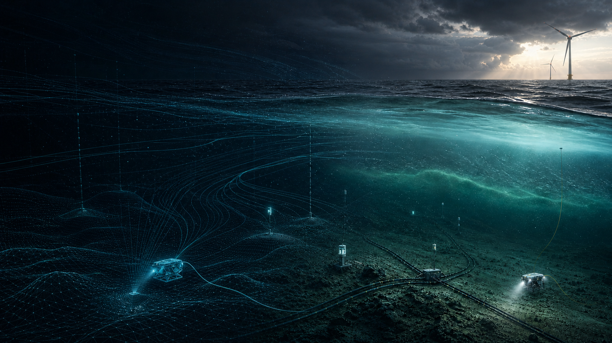

# Ocean World Labs

**The world model for the ocean**

For machines to understand, predict, and act in the ocean

High-fidelity ocean simulation is the foundation. The Ocean World Model is the core. Ocean embodied intelligence is the goal.

## Foundation

**OceanScale** is a working GPU-native alpha for controllable, reproducible ocean simulation, structured data generation, and evaluation. External physics validation remains in progress.

## Core

**Ocean World Model** is our internal, unreleased R&D into ocean-state evolution, action consequences, and future trajectories.

## Goal

**Ocean embodied intelligence** means machines that can understand changing ocean conditions, predict what follows, and act across dynamic ocean environments.

## NVIDIA technology path

OceanScale uses CUDA, RTX, Warp, and Newton, with PyTorch for learning workflows. Our validation path includes OpenUSD, Omniverse, Isaac Sim 6, and Isaac Lab 3. NVIDIA Cosmos 3 is part of our internal world-model R&D path. This is technology adoption, not a claim of partnership or endorsement.

## Open direction

We intend to contribute open reference assets, datasets, benchmarks, and evaluation protocols that make ocean robotics research more reproducible.

[Website](https://oceanworldlabs.ai) | [Contact](mailto:info@oceanworldlabs.ai)
